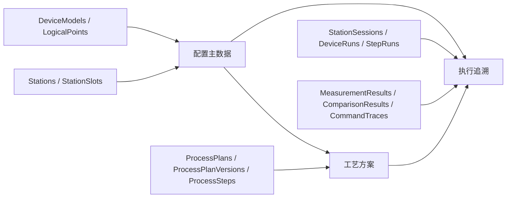
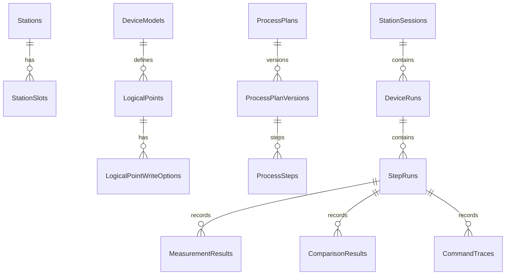

# VfdProductionControl 数据库设计说明

本文档说明当前版本的 SQL Server 数据库结构。设计以当前 UI 和业务逻辑为准：操作员执行生产测试，工程人员维护工艺方案和步骤，系统保存可追溯的执行记录。

数据库连接信息不写入本文档，也不提交到代码仓库。应用通过配置项 `ConnectionStrings:VfdProductionControl` 或 `Database:ConnectionString` 获取连接串。

## 设计原则

1. 配置主数据、工艺方案、执行追溯分开存储。
2. 常用查询字段结构化保存，避免依赖 JSON 才能查询。
3. JSON 字段仅作为扩展和兼容保留，不作为主要持久化路径。
4. 工艺步骤统一存入 `ProcessSteps`，点位读数比对是步骤类型，不是逻辑点位。
5. 执行追溯保存快照字段，保证方案或配置后续修改后，历史记录仍能解释当时的结果。
6. 建表脚本采用幂等方式，重复执行不会删除已有数据。

## 模块划分



## 表清单

| 模块 | 表名 | 用途 |
| --- | --- | --- |
| 工位配置 | `Stations` | 生产工位主表 |
| 工位配置 | `StationSlots` | 工位下的槽位、串口和 Modbus 地址配置 |
| 设备点位 | `DeviceModels` | 设备型号定义，如 VFD、仪表 |
| 设备点位 | `LogicalPoints` | 逻辑点位定义，如 `Vfd:Voltage`、`Instrument:Voltage` |
| 设备点位 | `LogicalPointWriteOptions` | 写入点位的可选写入值 |
| 工艺方案 | `ProcessPlans` | 工艺方案主表 |
| 工艺方案 | `ProcessPlanVersions` | 方案版本，支持发布和历史追溯 |
| 工艺方案 | `ProcessSteps` | 方案步骤明细，包含读取、写入、延迟、点位读数比对 |
| 执行追溯 | `StationSessions` | 一次工位测试会话 |
| 执行追溯 | `DeviceRuns` | 单个槽位、单台设备的一次执行记录 |
| 执行追溯 | `StepRuns` | 每个流程步骤的一次执行结果 |
| 执行追溯 | `MeasurementResults` | 读取步骤产生的测量结果 |
| 执行追溯 | `ComparisonResults` | 点位读数比对步骤产生的比对结果 |
| 执行追溯 | `CommandTraces` | 底层命令请求和响应追踪 |

## 配置主数据

### Stations

保存生产工位。

| 字段 | 类型 | 说明 |
| --- | --- | --- |
| `Id` | `UNIQUEIDENTIFIER` | 主键 |
| `Name` | `NVARCHAR(200)` | 工位名称 |
| `IsActive` | `BIT` | 是否启用 |
| `StationJson` | `NVARCHAR(MAX)` | 兼容扩展字段 |
| `CreatedAt` | `DATETIMEOFFSET` | 创建时间 |
| `UpdatedAt` | `DATETIMEOFFSET` | 更新时间 |

### StationSlots

保存工位下的槽位配置。当前 UI 中槽位直接配置串口、波特率和三类地址：VFD、电压表、电流表。

| 字段 | 类型 | 说明 |
| --- | --- | --- |
| `Id` | `UNIQUEIDENTIFIER` | 主键 |
| `StationId` | `UNIQUEIDENTIFIER` | 所属工位 |
| `SlotNumber` | `INT` | 槽位编号 |
| `DisplayName` | `NVARCHAR(120)` | 槽位显示名称 |
| `PortName` | `NVARCHAR(32)` | 串口名称，可为空 |
| `VfdAddress` | `TINYINT` | VFD Modbus 地址 |
| `VoltageMeterAddress` | `TINYINT` | 电压表 Modbus 地址 |
| `CurrentMeterAddress` | `TINYINT` | 电流表 Modbus 地址 |
| `BaudRate` | `INT` | 波特率 |
| `IsEnabled` | `BIT` | 是否启用 |
| `ConfigJson` | `NVARCHAR(MAX)` | 兼容扩展字段 |
| `CreatedAt` | `DATETIMEOFFSET` | 创建时间 |
| `UpdatedAt` | `DATETIMEOFFSET` | 更新时间 |

关系：`StationSlots.StationId` 外键引用 `Stations.Id`。

## 设备型号与逻辑点位

### DeviceModels

保存设备型号定义。当前建议将逻辑点位挂到设备型号，而不是挂到每个槽位，避免每个槽位重复维护相同点位。

| 字段 | 类型 | 说明 |
| --- | --- | --- |
| `Id` | `UNIQUEIDENTIFIER` | 主键 |
| `Name` | `NVARCHAR(200)` | 型号名称 |
| `DeviceType` | `NVARCHAR(50)` | 设备类型，如 `VFD`、`Instrument` |
| `IsActive` | `BIT` | 是否启用 |
| `CreatedAt` | `DATETIMEOFFSET` | 创建时间 |
| `UpdatedAt` | `DATETIMEOFFSET` | 更新时间 |

### LogicalPoints

保存逻辑点位定义。逻辑点位是“可读取或可写入的设备地址抽象”，例如 `Vfd:Voltage`。

| 字段 | 类型 | 说明 |
| --- | --- | --- |
| `Id` | `UNIQUEIDENTIFIER` | 主键 |
| `DeviceModelId` | `UNIQUEIDENTIFIER` | 所属设备型号 |
| `LogicalKey` | `NVARCHAR(100)` | 逻辑点位键 |
| `DisplayName` | `NVARCHAR(200)` | 显示名称 |
| `AccessMode` | `NVARCHAR(50)` | 访问方式，如读取、写入 |
| `FunctionCode` | `NVARCHAR(20)` | Modbus 功能码 |
| `RegisterAddress` | `NVARCHAR(50)` | 寄存器地址 |
| `DataType` | `NVARCHAR(50)` | 数据类型 |
| `Unit` | `NVARCHAR(50)` | 单位 |
| `Description` | `NVARCHAR(500)` | 说明 |
| `IsCustom` | `BIT` | 是否自定义点位 |
| `IsActive` | `BIT` | 是否启用 |
| `CreatedAt` | `DATETIMEOFFSET` | 创建时间 |
| `UpdatedAt` | `DATETIMEOFFSET` | 更新时间 |

关系：`LogicalPoints.DeviceModelId` 外键引用 `DeviceModels.Id`。

### LogicalPointWriteOptions

保存写入点位的候选值，例如 VFD 控制字的启动、停止值。

| 字段 | 类型 | 说明 |
| --- | --- | --- |
| `Id` | `UNIQUEIDENTIFIER` | 主键 |
| `LogicalPointId` | `UNIQUEIDENTIFIER` | 所属逻辑点位 |
| `Value` | `NVARCHAR(100)` | 实际写入值 |
| `DisplayText` | `NVARCHAR(200)` | UI 显示文本 |
| `SortOrder` | `INT` | 排序 |

关系：`LogicalPointWriteOptions.LogicalPointId` 外键引用 `LogicalPoints.Id`。

## 工艺方案

### ProcessPlans

保存工艺方案主信息。

| 字段 | 类型 | 说明 |
| --- | --- | --- |
| `Id` | `UNIQUEIDENTIFIER` | 主键 |
| `Name` | `NVARCHAR(200)` | 方案名称 |
| `IsActive` | `BIT` | 是否启用 |
| `PlanJson` | `NVARCHAR(MAX)` | 兼容扩展字段 |
| `CreatedAt` | `DATETIMEOFFSET` | 创建时间 |
| `UpdatedAt` | `DATETIMEOFFSET` | 更新时间 |

### ProcessPlanVersions

保存方案版本。执行记录应尽量关联到具体版本，而不是仅关联方案主表。

| 字段 | 类型 | 说明 |
| --- | --- | --- |
| `Id` | `UNIQUEIDENTIFIER` | 主键 |
| `ProcessPlanId` | `UNIQUEIDENTIFIER` | 所属方案 |
| `VersionNumber` | `INT` | 版本号 |
| `IsExecutable` | `BIT` | 是否可执行 |
| `StepsJson` | `NVARCHAR(MAX)` | 兼容字段，当前不作为主存储 |
| `CreatedAt` | `DATETIMEOFFSET` | 创建时间 |
| `PublishedAt` | `DATETIMEOFFSET` | 发布时间 |
| `Remark` | `NVARCHAR(500)` | 备注 |

关系：`ProcessPlanVersions.ProcessPlanId` 外键引用 `ProcessPlans.Id`。

### ProcessSteps

保存方案步骤。当前步骤类型包括：

| StepType | 说明 |
| --- | --- |
| `Start` | 写入启动命令 |
| `Stop` | 写入停止命令 |
| `Delay` | 延迟步骤 |
| `ReadMeasurement` | 读取数值点位 |
| `ReadString` | 读取文本点位 |
| `CompareMeasurement` | 基于两个逻辑点位读数进行比对 |

`CompareMeasurement` 是流程步骤类型，不是逻辑点位。

| 字段 | 类型 | 说明 |
| --- | --- | --- |
| `Id` | `UNIQUEIDENTIFIER` | 主键 |
| `PlanVersionId` | `UNIQUEIDENTIFIER` | 所属方案版本 |
| `Sequence` | `INT` | 步骤顺序 |
| `Name` | `NVARCHAR(200)` | 步骤名称 |
| `StepType` | `NVARCHAR(50)` | 步骤类型 |
| `TargetPointKey` | `NVARCHAR(100)` | 读取或写入步骤的目标点位 |
| `CommandValue` | `NVARCHAR(200)` | 写入值、延迟毫秒等 |
| `CompareLeftPointKey` | `NVARCHAR(100)` | 比对步骤左侧点位 |
| `CompareRightPointKey` | `NVARCHAR(100)` | 比对步骤右侧点位 |
| `ToleranceType` | `NVARCHAR(50)` | 容差类型，`Absolute` 或 `Percent` |
| `ToleranceValue` | `DECIMAL(18,6)` | 容差值 |
| `RuleType` | `NVARCHAR(50)` | 核对规则类型 |
| `LowerLimit` | `DECIMAL(18,6)` | 数值下限 |
| `UpperLimit` | `DECIMAL(18,6)` | 数值上限 |
| `ExpectedValue` | `NVARCHAR(200)` | 文本期望值 |
| `FailureAction` | `NVARCHAR(50)` | 失败策略 |
| `MaxRetries` | `INT` | 最大重试次数 |
| `AffectsFinalConclusion` | `BIT` | 是否影响最终结论 |
| `CreatedAt` | `DATETIMEOFFSET` | 创建时间 |

关系：`ProcessSteps.PlanVersionId` 外键引用 `ProcessPlanVersions.Id`。

## 执行追溯

### StationSessions

保存一次工位级测试会话。

| 字段 | 类型 | 说明 |
| --- | --- | --- |
| `SessionId` | `UNIQUEIDENTIFIER` | 主键 |
| `StationId` | `UNIQUEIDENTIFIER` | 工位 ID |
| `ProcessPlanVersionId` | `UNIQUEIDENTIFIER` | 执行的方案版本，可为空 |
| `OperatorCode` | `NVARCHAR(64)` | 员工码 |
| `StartedAt` | `DATETIMEOFFSET` | 开始时间 |
| `EndedAt` | `DATETIMEOFFSET` | 结束时间 |
| `Conclusion` | `NVARCHAR(50)` | 会话结论 |
| `SessionJson` | `NVARCHAR(MAX)` | 扩展字段 |

### DeviceRuns

保存单槽位、单条码设备的一次执行记录。

| 字段 | 类型 | 说明 |
| --- | --- | --- |
| `DeviceRunId` | `UNIQUEIDENTIFIER` | 主键 |
| `SessionId` | `UNIQUEIDENTIFIER` | 所属会话 |
| `SlotId` | `UNIQUEIDENTIFIER` | 槽位 ID |
| `Barcode` | `NVARCHAR(100)` | VFD 条码 |
| `Conclusion` | `NVARCHAR(50)` | 设备执行结论 |
| `StartedAt` | `DATETIMEOFFSET` | 开始时间 |
| `CompletedAt` | `DATETIMEOFFSET` | 完成时间 |
| `RunJson` | `NVARCHAR(MAX)` | 扩展字段 |

关系：`DeviceRuns.SessionId` 外键引用 `StationSessions.SessionId`。

### StepRuns

保存一次步骤执行结果，并保存步骤快照字段。

| 字段 | 类型 | 说明 |
| --- | --- | --- |
| `StepRunId` | `UNIQUEIDENTIFIER` | 主键 |
| `DeviceRunId` | `UNIQUEIDENTIFIER` | 所属设备执行 |
| `ProcessStepId` | `UNIQUEIDENTIFIER` | 对应方案步骤，可为空 |
| `Sequence` | `INT` | 步骤顺序快照 |
| `StepName` | `NVARCHAR(200)` | 步骤名称快照 |
| `StepType` | `NVARCHAR(50)` | 步骤类型快照 |
| `Conclusion` | `NVARCHAR(50)` | 步骤结论 |
| `Message` | `NVARCHAR(500)` | 步骤结果说明 |
| `StartedAt` | `DATETIMEOFFSET` | 开始时间 |
| `CompletedAt` | `DATETIMEOFFSET` | 完成时间 |
| `StepJson` | `NVARCHAR(MAX)` | 扩展字段 |

关系：`StepRuns.DeviceRunId` 外键引用 `DeviceRuns.DeviceRunId`。

### MeasurementResults

保存读取步骤产生的测量值。

| 字段 | 类型 | 说明 |
| --- | --- | --- |
| `Id` | `BIGINT IDENTITY` | 主键 |
| `StepRunId` | `UNIQUEIDENTIFIER` | 所属步骤执行 |
| `PointKey` | `NVARCHAR(100)` | 逻辑点位键 |
| `Source` | `NVARCHAR(50)` | 数据来源，如 `Vfd`、`Instrument` |
| `NumericValue` | `DECIMAL(18,6)` | 数值结果 |
| `TextValue` | `NVARCHAR(200)` | 文本结果 |
| `Unit` | `NVARCHAR(50)` | 单位 |
| `Conclusion` | `NVARCHAR(50)` | 读取核对结论 |
| `Message` | `NVARCHAR(500)` | 结果说明 |
| `MeasurementJson` | `NVARCHAR(MAX)` | 扩展字段 |

关系：`MeasurementResults.StepRunId` 外键引用 `StepRuns.StepRunId`。

### ComparisonResults

保存点位读数比对结果。

| 字段 | 类型 | 说明 |
| --- | --- | --- |
| `Id` | `BIGINT IDENTITY` | 主键 |
| `StepRunId` | `UNIQUEIDENTIFIER` | 所属步骤执行 |
| `LeftKey` | `NVARCHAR(100)` | 左侧点位 |
| `RightKey` | `NVARCHAR(100)` | 右侧点位 |
| `PrimaryValue` | `DECIMAL(18,6)` | 被测值 |
| `ReferenceValue` | `DECIMAL(18,6)` | 参考值 |
| `DifferenceValue` | `DECIMAL(18,6)` | 差值 |
| `DifferencePercent` | `DECIMAL(18,6)` | 误差百分比 |
| `ToleranceType` | `NVARCHAR(50)` | 容差类型 |
| `ToleranceValue` | `DECIMAL(18,6)` | 容差值 |
| `Conclusion` | `NVARCHAR(50)` | 比对结论 |
| `Message` | `NVARCHAR(500)` | 比对说明 |
| `ComparisonJson` | `NVARCHAR(MAX)` | 扩展字段 |

关系：`ComparisonResults.StepRunId` 外键引用 `StepRuns.StepRunId`。

### CommandTraces

保存底层命令追踪，用于排查通信、设备响应和执行异常。

| 字段 | 类型 | 说明 |
| --- | --- | --- |
| `TraceId` | `UNIQUEIDENTIFIER` | 主键 |
| `StepRunId` | `UNIQUEIDENTIFIER` | 所属步骤执行 |
| `SlotId` | `UNIQUEIDENTIFIER` | 槽位 ID |
| `CommandName` | `NVARCHAR(100)` | 命令名称 |
| `TargetPointKey` | `NVARCHAR(100)` | 目标点位 |
| `RequestJson` | `NVARCHAR(MAX)` | 请求内容 |
| `ResponseJson` | `NVARCHAR(MAX)` | 响应内容 |
| `IsSuccess` | `BIT` | 是否成功 |
| `ErrorCode` | `NVARCHAR(100)` | 错误码 |
| `Message` | `NVARCHAR(500)` | 说明 |
| `CreatedAt` | `DATETIMEOFFSET` | 记录时间 |

关系：`CommandTraces.StepRunId` 外键引用 `StepRuns.StepRunId`。

## 关键关系



## 结论枚举

当前执行结论使用字符串保存，常见值如下：

| 值 | 说明 |
| --- | --- |
| `Pending` | 待执行 |
| `Running` | 运行中 |
| `Pass` | 通过 |
| `Fail` | 失败 |
| `Warning` | 警告 |
| `Skipped` | 跳过 |

实际可用值以代码中的 `Conclusion` 枚举为准。

## 失败策略

`ProcessSteps.FailureAction` 保存步骤失败时的处理方式，常见值如下：

| 值 | 说明 |
| --- | --- |
| `ContinueAndMarkFail` | 继续执行并标记失败 |
| `ContinueAsWarning` | 继续执行并标记警告 |
| `StopSlotImmediately` | 立即停止当前槽位 |
| `PauseAllSlots` | 暂停全部槽位 |
| `RetryThenStop` | 重试后停止 |
| `RequireOperatorConfirm` | 需要人工确认 |

## 初始化方式

数据库初始化脚本位于：

```text
src/VfdControl.Infrastructure/Sql/schema.sql
```

应用通过 `DatabaseInitializer.InitializeAsync` 执行该脚本。脚本使用 `IF OBJECT_ID(..., 'U') IS NULL` 判断表是否存在，因此可重复执行。

当前脚本也包含兼容迁移：

| 旧字段 | 新字段 |
| --- | --- |
| `MeasurementResults.PointName` | `MeasurementResults.PointKey` |
| `MeasurementResults.Value` | `MeasurementResults.NumericValue` |

## 测试方式

常规测试不依赖真实数据库：

```powershell
dotnet test --no-restore
```

真实数据库集成测试通过环境变量提供连接串：

```powershell
$env:VFD_SQL_TEST_CONNECTION_STRING = "<SQL Server connection string>"
dotnet test tests\VfdControl.Infrastructure.Tests\VfdControl.Infrastructure.Tests.csproj --no-restore --filter "FullyQualifiedName~SqlRepositoryIntegrationTests"
Remove-Item Env:\VFD_SQL_TEST_CONNECTION_STRING
```

集成测试会：

1. 执行数据库初始化脚本。
2. 写入测试工位和槽位。
3. 写入测试方案、版本和步骤。
4. 从数据库读回并校验结构化字段。
5. 清理本次测试写入的数据。

## 后续建议

1. 给高频查询字段补充索引，例如 `DeviceRuns.Barcode`、`DeviceRuns.StartedAt`、`StationSessions.StartedAt`、`StepRuns.DeviceRunId`。
2. 在真实生产环境启用前，补充数据库备份和迁移版本管理。
3. 后续如果设备型号和逻辑点位需要正式编辑保存，应增加对应仓储和 UI 保存逻辑。
4. 如果追溯报表需要统计误差趋势，应优先查询 `ComparisonResults.DifferenceValue` 和 `DifferencePercent`。
