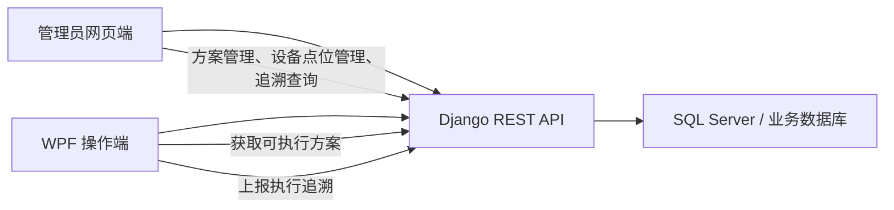

# Django 后端建表与 WPF 端到端互通操作文档

本文档用于指导后端 Django 项目设计数据库表、提供 API，并保证前端工程维护页面、Django 后端、WPF 操作端可以端到端互通。

核心结论：数据库表应由 Django 后端统一管理，WPF 不再负责正式业务表建表，也不直接修改测试方案表。WPF 通过后端 API 获取可执行方案、上报执行追溯；前端通过后端 API 编辑、校验、发布方案。

## 当前项目适配结论

结合当前 LXMES Django 后端和 VfdProductionControl WPF 工程，落地前必须先明确以下问题：

1. 不建议把本文档的新模型合并进当前 `production` app。当前 `production` 已承载生产计划、工单、条码关系、生产数据等通用 MES 职责；VFD 测试方案、逻辑点位和追溯属于独立子域，应新建独立 app 组合，或先收敛到一个独立的 `vfd_control` app。
2. 用户体系必须先统一。当前后端同时存在 `user.SysUser` 和 `core.User(AbstractUser)`，JWT 认证实际返回 `SysUser`；因此不能直接照搬 `settings.AUTH_USER_MODEL` 外键，除非先设置并迁移统一的用户模型。
3. 现有后端路由已经使用 `/api/core/`、`/api/product/`、`/api/equipment/`、`/api/production/` 等模块路径。本文档建议的管理员和运行端接口应在当前项目中落到 `/api/vfd/admin/` 与 `/api/vfd/runtime/`，避免和现有业务模块、Django admin 语义混淆。
4. 当前 WPF 已有 `IProcessPlanRepository` 和 `ITraceRepository`。方案读取可以新增 `HttpProcessPlanRepository`；追溯上报建议新增批量型 `HttpTraceRepository`，在本地收集一次执行中的 session、device run、step、measurement、comparison、command trace，再通过一个事务性 API 批量提交。
5. LXMES 现有多数业务模型继承 `FactoryScopedModel`，带有 `factory` 维度。VFD 相关表如果需要多工厂隔离，应在建表前明确是否继承同类工厂范围模型。
6. 当前后端存在明文数据库连接信息、全量 CORS 放开和默认权限注释的情况。正式接入本文档接口前，应把数据库密码迁移到环境变量，并启用写接口认证、权限和审计。

## 一、目标架构



### 边界原则

1. Django 后端是数据库结构和业务规则的唯一维护方。
2. 管理员网页端只通过 API 管理测试方案、设备型号、逻辑点位和追溯查询，不直接连接数据库。
3. WPF 操作端只通过 API 获取方案、上报执行结果，不直接修改方案表。
4. 已发布方案版本不可原地修改，修改方案必须生成新版本。
5. 执行追溯必须记录当时使用的方案版本和步骤快照。

### 管理员网页端能力边界

管理员网页端必须覆盖三类业务能力：

1. 测试方案管理：对方案增删改查，对方案版本和步骤进行新增、复制、删除、排序、配置、校验和发布。
2. 设备型号配置管理：对设备型号增删改查，对型号下的逻辑点位、写入选项进行增删改查和启停用。
3. 追溯查询：按条码、工位、槽位、操作员、方案版本、结论和时间范围查询历史，并查看步骤、测量、比对和命令追踪详情。

WPF 操作端不是管理端。WPF 只消费已发布可执行配置，并上报执行结果。

## 二、推荐 Django 应用划分

建议在 Django 后端中拆成以下 app：

```text
apps/
  stations/       # 工位、槽位、设备地址配置
  devices/        # 设备型号、逻辑点位
  process_plans/  # 测试方案、版本、步骤
  traceability/   # 执行会话、设备执行、步骤结果、测量/比对/命令追踪
  accounts/       # 用户、员工码、权限，可后续扩展
```

针对当前 LXMES 项目，不建议合并进现有 `production` app。该 app 已用于生产计划、工单、条码扫描和生产数据，继续承载 VFD 测试方案会造成职责混杂和路由歧义。

推荐两种落地方式：

1. 长期方式：按上面的边界拆成 `stations`、`devices`、`process_plans`、`traceability` 等 app。
2. 过渡方式：先新建一个独立 `vfd_control` app，内部按模型、序列化器、视图模块拆分，接口仍按 `/api/vfd/admin/` 和 `/api/vfd/runtime/` 分区。

## 三、数据库模型设计

下面模型字段以 Django ORM 为准。实际数据库字段名可保持 Django 默认蛇形命名，也可以通过 `db_table` 固定为清晰表名。

### 管理后台通用字段建议

管理员网页端需要完整增删改查，因此建议所有可维护主数据表都继承通用字段。

当前 LXMES 项目注意事项：
- 如果沿用 `SysUserJWTAuthentication`，`created_by`、`updated_by` 和 `AuditLog.operator` 应先指向当前认证实际返回的 `user.SysUser`，或先统一到一个正式 `AUTH_USER_MODEL` 后再建表。
- 如果 VFD 数据需要按工厂隔离，可将下面的通用字段和现有 `FactoryScopedModel` 的 `factory` 字段合并成项目内专用基类，例如 `VfdAdminManagedModel`。
- 不要在用户模型未统一前生成包含 `settings.AUTH_USER_MODEL` 外键的 migration，否则后续迁移成本会比较高。

```python
class AdminManagedModel(models.Model):
    is_active = models.BooleanField(default=True)
    deleted_at = models.DateTimeField(blank=True, null=True)
    created_at = models.DateTimeField(auto_now_add=True)
    updated_at = models.DateTimeField(auto_now=True)
    created_by = models.ForeignKey(
        settings.AUTH_USER_MODEL,
        on_delete=models.SET_NULL,
        blank=True,
        null=True,
        related_name="+")
    updated_by = models.ForeignKey(
        settings.AUTH_USER_MODEL,
        on_delete=models.SET_NULL,
        blank=True,
        null=True,
        related_name="+")

    class Meta:
        abstract = True
```

适用表：
- `Station`
- `StationSlot`
- `DeviceModel`
- `LogicalPoint`
- `LogicalPointWriteOption`
- `ProcessPlan`
- `ProcessPlanVersion`
- `ProcessStep`

删除策略：
- 管理端删除默认软删除，设置 `deleted_at` 或 `is_active=false`。
- 已被发布方案引用的逻辑点位不允许物理删除。
- 已产生追溯记录的方案版本、步骤、槽位不允许物理删除。
- 物理删除只允许用于未发布、未引用的草稿数据。

### 1. 工位与槽位

```python
class Station(models.Model):
    id = models.UUIDField(primary_key=True, default=uuid.uuid4, editable=False)
    name = models.CharField(max_length=200)
    is_active = models.BooleanField(default=True)
    created_at = models.DateTimeField(auto_now_add=True)
    updated_at = models.DateTimeField(auto_now=True)

    class Meta:
        db_table = "stations"


class StationSlot(models.Model):
    id = models.UUIDField(primary_key=True, default=uuid.uuid4, editable=False)
    station = models.ForeignKey(Station, related_name="slots", on_delete=models.CASCADE)
    slot_number = models.PositiveIntegerField()
    display_name = models.CharField(max_length=120)
    port_name = models.CharField(max_length=32, blank=True, null=True)
    baud_rate = models.PositiveIntegerField(default=9600)
    vfd_address = models.PositiveSmallIntegerField()
    voltage_meter_address = models.PositiveSmallIntegerField()
    current_meter_address = models.PositiveSmallIntegerField()
    is_enabled = models.BooleanField(default=True)
    created_at = models.DateTimeField(auto_now_add=True)
    updated_at = models.DateTimeField(auto_now=True)

    class Meta:
        db_table = "station_slots"
        constraints = [
            models.UniqueConstraint(fields=["station", "slot_number"], name="uq_station_slot_number"),
        ]
```

说明：
- `StationSlot` 是 WPF 操作端运行时需要的槽位配置来源。
- WPF 获取站点配置后，应使用 `port_name`、`baud_rate` 和三个地址建立设备通信上下文。

### 2. 设备型号与逻辑点位

```python
class DeviceModel(models.Model):
    DEVICE_TYPE_CHOICES = [
        ("VFD", "VFD"),
        ("INSTRUMENT", "Instrument"),
    ]

    id = models.UUIDField(primary_key=True, default=uuid.uuid4, editable=False)
    name = models.CharField(max_length=200)
    device_type = models.CharField(max_length=50, choices=DEVICE_TYPE_CHOICES)
    is_active = models.BooleanField(default=True)
    created_at = models.DateTimeField(auto_now_add=True)
    updated_at = models.DateTimeField(auto_now=True)

    class Meta:
        db_table = "device_models"


class LogicalPoint(models.Model):
    ACCESS_MODE_CHOICES = [
        ("READ", "Read"),
        ("WRITE", "Write"),
        ("READ_WRITE", "Read/Write"),
    ]

    id = models.UUIDField(primary_key=True, default=uuid.uuid4, editable=False)
    device_model = models.ForeignKey(DeviceModel, related_name="logical_points", on_delete=models.CASCADE)
    logical_key = models.CharField(max_length=100)
    display_name = models.CharField(max_length=200)
    access_mode = models.CharField(max_length=50, choices=ACCESS_MODE_CHOICES)
    function_code = models.CharField(max_length=20)
    register_address = models.CharField(max_length=50)
    data_type = models.CharField(max_length=50)
    unit = models.CharField(max_length=50, blank=True, null=True)
    description = models.CharField(max_length=500, blank=True, null=True)
    is_custom = models.BooleanField(default=False)
    is_active = models.BooleanField(default=True)
    created_at = models.DateTimeField(auto_now_add=True)
    updated_at = models.DateTimeField(auto_now=True)

    class Meta:
        db_table = "logical_points"
        constraints = [
            models.UniqueConstraint(fields=["device_model", "logical_key"], name="uq_device_logical_key"),
        ]


class LogicalPointWriteOption(models.Model):
    id = models.UUIDField(primary_key=True, default=uuid.uuid4, editable=False)
    logical_point = models.ForeignKey(LogicalPoint, related_name="write_options", on_delete=models.CASCADE)
    value = models.CharField(max_length=100)
    display_text = models.CharField(max_length=200)
    sort_order = models.IntegerField(default=0)

    class Meta:
        db_table = "logical_point_write_options"
        ordering = ["sort_order", "display_text"]
```

说明：
- 逻辑点位是设备地址抽象，如 `Vfd:Voltage`、`Instrument:Voltage`。
- 点位读数比对不是逻辑点位，不应写入 `LogicalPoint`。

### 3. 测试方案、版本与步骤

```python
class ProcessPlan(models.Model):
    id = models.UUIDField(primary_key=True, default=uuid.uuid4, editable=False)
    name = models.CharField(max_length=200)
    is_active = models.BooleanField(default=True)
    created_at = models.DateTimeField(auto_now_add=True)
    updated_at = models.DateTimeField(auto_now=True)

    class Meta:
        db_table = "process_plans"


class ProcessPlanVersion(models.Model):
    id = models.UUIDField(primary_key=True, default=uuid.uuid4, editable=False)
    process_plan = models.ForeignKey(ProcessPlan, related_name="versions", on_delete=models.CASCADE)
    version_number = models.PositiveIntegerField()
    is_draft = models.BooleanField(default=True)
    is_executable = models.BooleanField(default=False)
    created_at = models.DateTimeField(auto_now_add=True)
    published_at = models.DateTimeField(blank=True, null=True)
    remark = models.CharField(max_length=500, blank=True, null=True)

    class Meta:
        db_table = "process_plan_versions"
        constraints = [
            models.UniqueConstraint(fields=["process_plan", "version_number"], name="uq_plan_version_number"),
        ]


class ProcessStep(models.Model):
    STEP_TYPE_CHOICES = [
        ("START", "Start"),
        ("STOP", "Stop"),
        ("DELAY", "Delay"),
        ("READ_MEASUREMENT", "Read measurement"),
        ("READ_STRING", "Read string"),
        ("COMPARE_MEASUREMENT", "Compare measurement"),
    ]

    FAILURE_ACTION_CHOICES = [
        ("CONTINUE_AND_MARK_FAIL", "Continue and mark fail"),
        ("CONTINUE_AS_WARNING", "Continue as warning"),
        ("STOP_SLOT_IMMEDIATELY", "Stop slot immediately"),
        ("PAUSE_ALL_SLOTS", "Pause all slots"),
        ("RETRY_THEN_STOP", "Retry then stop"),
        ("REQUIRE_OPERATOR_CONFIRM", "Require operator confirm"),
    ]

    id = models.UUIDField(primary_key=True, default=uuid.uuid4, editable=False)
    plan_version = models.ForeignKey(ProcessPlanVersion, related_name="steps", on_delete=models.CASCADE)
    sequence = models.PositiveIntegerField()
    name = models.CharField(max_length=200)
    step_type = models.CharField(max_length=50, choices=STEP_TYPE_CHOICES)

    target_point_key = models.CharField(max_length=100, blank=True, null=True)
    command_value = models.CharField(max_length=200, blank=True, null=True)

    compare_left_point_key = models.CharField(max_length=100, blank=True, null=True)
    compare_right_point_key = models.CharField(max_length=100, blank=True, null=True)
    tolerance_type = models.CharField(max_length=50, blank=True, null=True)
    tolerance_value = models.DecimalField(max_digits=18, decimal_places=6, blank=True, null=True)

    rule_type = models.CharField(max_length=50, blank=True, null=True)
    lower_limit = models.DecimalField(max_digits=18, decimal_places=6, blank=True, null=True)
    upper_limit = models.DecimalField(max_digits=18, decimal_places=6, blank=True, null=True)
    expected_value = models.CharField(max_length=200, blank=True, null=True)

    failure_action = models.CharField(max_length=50, choices=FAILURE_ACTION_CHOICES)
    max_retries = models.PositiveIntegerField(default=0)
    affects_final_conclusion = models.BooleanField(default=True)
    is_enabled = models.BooleanField(default=True)
    created_at = models.DateTimeField(auto_now_add=True)

    class Meta:
        db_table = "process_steps"
        ordering = ["sequence"]
        constraints = [
            models.UniqueConstraint(fields=["plan_version", "sequence"], name="uq_plan_version_step_sequence"),
        ]
```

#### ProcessStep 字段使用规则

| 步骤类型 | 使用字段 |
| --- | --- |
| `START` / `STOP` | `target_point_key`、`command_value` |
| `DELAY` | `command_value` 保存毫秒数，`target_point_key` 可固定为 `Timer` |
| `READ_MEASUREMENT` | `target_point_key`，可选 `rule_type/lower_limit/upper_limit` |
| `READ_STRING` | `target_point_key`，可选 `expected_value` |
| `COMPARE_MEASUREMENT` | `compare_left_point_key`、`compare_right_point_key`、`tolerance_type`、`tolerance_value` |

重点：`COMPARE_MEASUREMENT` 与 `DELAY` 是同层级的流程步骤类型。它基于两个逻辑点位的读数进行计算，但自身不是逻辑点位。

### 4. 执行追溯

```python
class StationSession(models.Model):
    id = models.UUIDField(primary_key=True, default=uuid.uuid4, editable=False)
    station = models.ForeignKey(Station, on_delete=models.PROTECT)
    process_plan_version = models.ForeignKey(ProcessPlanVersion, on_delete=models.PROTECT, blank=True, null=True)
    operator_code = models.CharField(max_length=64)
    started_at = models.DateTimeField()
    ended_at = models.DateTimeField(blank=True, null=True)
    conclusion = models.CharField(max_length=50, blank=True, null=True)

    class Meta:
        db_table = "station_sessions"


class DeviceRun(models.Model):
    id = models.UUIDField(primary_key=True, default=uuid.uuid4, editable=False)
    session = models.ForeignKey(StationSession, related_name="device_runs", on_delete=models.CASCADE)
    slot = models.ForeignKey(StationSlot, on_delete=models.PROTECT)
    barcode = models.CharField(max_length=100)
    conclusion = models.CharField(max_length=50)
    started_at = models.DateTimeField()
    completed_at = models.DateTimeField(blank=True, null=True)

    class Meta:
        db_table = "device_runs"
        indexes = [
            models.Index(fields=["barcode"]),
            models.Index(fields=["started_at"]),
        ]


class StepRun(models.Model):
    id = models.UUIDField(primary_key=True, default=uuid.uuid4, editable=False)
    device_run = models.ForeignKey(DeviceRun, related_name="steps", on_delete=models.CASCADE)
    process_step = models.ForeignKey(ProcessStep, on_delete=models.SET_NULL, blank=True, null=True)
    sequence = models.PositiveIntegerField()
    step_name = models.CharField(max_length=200)
    step_type = models.CharField(max_length=50, blank=True, null=True)
    conclusion = models.CharField(max_length=50)
    message = models.CharField(max_length=500, blank=True, null=True)
    started_at = models.DateTimeField(auto_now_add=True)
    completed_at = models.DateTimeField(blank=True, null=True)

    class Meta:
        db_table = "step_runs"
        ordering = ["sequence"]


class MeasurementResult(models.Model):
    step_run = models.ForeignKey(StepRun, related_name="measurements", on_delete=models.CASCADE)
    point_key = models.CharField(max_length=100)
    source = models.CharField(max_length=50)
    numeric_value = models.DecimalField(max_digits=18, decimal_places=6, blank=True, null=True)
    text_value = models.CharField(max_length=200, blank=True, null=True)
    unit = models.CharField(max_length=50, blank=True, null=True)
    conclusion = models.CharField(max_length=50, blank=True, null=True)
    message = models.CharField(max_length=500, blank=True, null=True)

    class Meta:
        db_table = "measurement_results"


class ComparisonResult(models.Model):
    step_run = models.ForeignKey(StepRun, related_name="comparisons", on_delete=models.CASCADE)
    left_key = models.CharField(max_length=100)
    right_key = models.CharField(max_length=100)
    primary_value = models.DecimalField(max_digits=18, decimal_places=6, blank=True, null=True)
    reference_value = models.DecimalField(max_digits=18, decimal_places=6, blank=True, null=True)
    difference_value = models.DecimalField(max_digits=18, decimal_places=6, blank=True, null=True)
    difference_percent = models.DecimalField(max_digits=18, decimal_places=6, blank=True, null=True)
    tolerance_type = models.CharField(max_length=50, blank=True, null=True)
    tolerance_value = models.DecimalField(max_digits=18, decimal_places=6, blank=True, null=True)
    conclusion = models.CharField(max_length=50)
    message = models.CharField(max_length=500, blank=True, null=True)

    class Meta:
        db_table = "comparison_results"


class CommandTrace(models.Model):
    id = models.UUIDField(primary_key=True, default=uuid.uuid4, editable=False)
    step_run = models.ForeignKey(StepRun, related_name="command_traces", on_delete=models.CASCADE)
    slot = models.ForeignKey(StationSlot, on_delete=models.PROTECT)
    command_name = models.CharField(max_length=100)
    target_point_key = models.CharField(max_length=100, blank=True, null=True)
    request_json = models.JSONField()
    response_json = models.JSONField()
    is_success = models.BooleanField()
    error_code = models.CharField(max_length=100, blank=True, null=True)
    message = models.CharField(max_length=500, blank=True, null=True)
    created_at = models.DateTimeField(auto_now_add=True)

    class Meta:
        db_table = "command_traces"
```

### 5. 权限与审计

管理员网页端所有写操作必须鉴权，并记录审计日志。

当前 LXMES 后端已有自定义 `SysUserJWTAuthentication`，并且当前 JWT 用户来自 `user.SysUser`。因此审计设计必须二选一：

1. 继续沿用 `SysUser`：`AuditLog.operator` 使用 `ForeignKey("user.SysUser")`，DRF 权限基于当前 `request.user`。
2. 统一到 Django 正式用户模型：先设置并迁移 `AUTH_USER_MODEL`，再使用 `settings.AUTH_USER_MODEL`。

在没有完成用户模型统一前，不应混用 `core.User`、`user.SysUser` 和默认 `auth.User`。

```python
class AuditLog(models.Model):
    id = models.UUIDField(primary_key=True, default=uuid.uuid4, editable=False)
    operator = models.ForeignKey(settings.AUTH_USER_MODEL, on_delete=models.SET_NULL, null=True)
    action = models.CharField(max_length=100)
    target_type = models.CharField(max_length=100)
    target_id = models.CharField(max_length=100)
    before_json = models.JSONField(blank=True, null=True)
    after_json = models.JSONField(blank=True, null=True)
    created_at = models.DateTimeField(auto_now_add=True)

    class Meta:
        db_table = "audit_logs"
        indexes = [
            models.Index(fields=["target_type", "target_id"]),
            models.Index(fields=["created_at"]),
        ]
```

必须记录的动作：
- 创建、修改、删除或停用测试方案。
- 创建草稿版本、修改步骤、复制步骤、删除步骤、调整步骤顺序。
- 校验方案和发布方案。
- 创建、修改、删除或停用设备型号。
- 创建、修改、删除或停用逻辑点位和写入选项。
- 追溯记录一般不允许管理端修改，如果未来增加纠错功能，也必须进入审计日志。

## 四、Django 建表操作步骤

### 1. 安装依赖

如果使用 SQL Server，建议后端使用 `mssql-django`：

```powershell
pip install django djangorestframework mssql-django pyodbc
```

也可以使用你后端当前已经稳定的 SQL Server 驱动，关键是由 Django migration 管理表结构。

### 2. 配置数据库连接

示例：

```python
DATABASES = {
    "default": {
        "ENGINE": "mssql",
        "NAME": env("DB_NAME"),
        "USER": env("DB_USER"),
        "PASSWORD": env("DB_PASSWORD"),
        "HOST": env("DB_HOST"),
        "PORT": env("DB_PORT"),
        "OPTIONS": {
            "driver": "ODBC Driver 18 for SQL Server",
            "extra_params": "TrustServerCertificate=yes",
        },
    }
}
```

不要把密码写进代码仓库。使用 `.env`、部署环境变量或服务器密钥配置。

### 3. 创建 app

```powershell
python manage.py startapp stations
python manage.py startapp devices
python manage.py startapp process_plans
python manage.py startapp traceability
```

在 `INSTALLED_APPS` 中注册：

```python
INSTALLED_APPS = [
    ...
    "rest_framework",
    "apps.stations",
    "apps.devices",
    "apps.process_plans",
    "apps.traceability",
]
```

### 4. 写入 models

将本文档中的模型拆分到对应 app 的 `models.py`。如果项目已有统一命名规范，可以保留模型字段含义，按后端规范调整类名和 app 位置。

### 5. 生成迁移

```powershell
python manage.py makemigrations
python manage.py migrate
```

迁移完成后，用后端数据库工具确认核心表存在：

```sql
SELECT name
FROM sys.tables
WHERE name IN (
  'process_plans',
  'process_plan_versions',
  'process_steps',
  'station_sessions',
  'device_runs',
  'step_runs'
);
```

## 五、DRF API 合同设计

后端所有 API 必须遵循 Django REST Framework 规范：

1. 使用 `DefaultRouter` 或 `SimpleRouter` 注册 ViewSet。
2. 资源路径使用复数名词，URL 末尾保留 `/`。
3. 标准增删改查使用 `ModelViewSet` 或 `ReadOnlyModelViewSet`。
4. 发布、校验、复制、重排、获取可执行版本等业务动作使用 `@action`。
5. 管理员网页端 API 放在 VFD 子域的管理命名空间。新建独立 app 时建议使用 `/api/vfd/admin/`。
6. WPF 运行端 API 放在 VFD 子域的运行命名空间。新建独立 app 时建议使用 `/api/vfd/runtime/`。
7. 所有写接口必须启用认证、权限校验和审计日志。

### DRF Router 建议

```python
router = DefaultRouter()
router.register("admin/process-plans", ProcessPlanViewSet, basename="vfd-admin-process-plan")
router.register("admin/process-plan-versions", ProcessPlanVersionViewSet, basename="vfd-admin-process-plan-version")
router.register("admin/process-steps", ProcessStepViewSet, basename="vfd-admin-process-step")
router.register("admin/device-models", DeviceModelViewSet, basename="vfd-admin-device-model")
router.register("admin/logical-points", LogicalPointViewSet, basename="vfd-admin-logical-point")
router.register("admin/logical-point-write-options", LogicalPointWriteOptionViewSet, basename="vfd-admin-logical-point-write-option")
router.register("admin/station-sessions", StationSessionViewSet, basename="vfd-admin-station-session")
router.register("admin/device-runs", DeviceRunViewSet, basename="vfd-admin-device-run")
router.register("runtime/process-plan-versions", RuntimeProcessPlanVersionViewSet, basename="vfd-runtime-process-plan-version")
router.register("runtime/stations", RuntimeStationViewSet, basename="vfd-runtime-station")
router.register("runtime/logical-points", RuntimeLogicalPointViewSet, basename="vfd-runtime-logical-point")
router.register("runtime/device-runs", RuntimeDeviceRunViewSet, basename="vfd-runtime-device-run")
```

### 1. 管理员测试方案 API

`ProcessPlanViewSet` 使用 `ModelViewSet`。

| 场景 | DRF 接口 |
| --- | --- |
| 方案列表 | `GET /api/vfd/admin/process-plans/` |
| 创建方案 | `POST /api/vfd/admin/process-plans/` |
| 方案详情 | `GET /api/vfd/admin/process-plans/{id}/` |
| 修改方案 | `PATCH /api/vfd/admin/process-plans/{id}/` |
| 删除或停用方案 | `DELETE /api/vfd/admin/process-plans/{id}/` |

建议查询参数：

```text
keyword
is_active
has_executable_version
page
page_size
ordering
```

建议扩展动作：

```python
@action(detail=True, methods=["post"], url_path="copy")
def copy(self, request, pk=None):
    ...
```

对应接口：

```http
POST /api/vfd/admin/process-plans/{id}/copy/
```

### 2. 管理员方案版本 API

`ProcessPlanVersionViewSet` 使用 `ModelViewSet`。

| 场景 | DRF 接口 |
| --- | --- |
| 版本列表 | `GET /api/vfd/admin/process-plan-versions/` |
| 创建版本 | `POST /api/vfd/admin/process-plan-versions/` |
| 版本详情 | `GET /api/vfd/admin/process-plan-versions/{id}/` |
| 修改草稿版本 | `PATCH /api/vfd/admin/process-plan-versions/{id}/` |
| 删除草稿版本 | `DELETE /api/vfd/admin/process-plan-versions/{id}/` |

建议查询参数：

```text
process_plan_id
status
is_executable
page
page_size
```

版本业务动作使用 `@action`：

```python
@action(detail=True, methods=["post"], url_path="copy-as-draft")
def copy_as_draft(self, request, pk=None):
    ...

@action(detail=True, methods=["post"], url_path="validate")
def validate_version(self, request, pk=None):
    ...

@action(detail=True, methods=["post"], url_path="publish")
def publish(self, request, pk=None):
    ...

@action(detail=True, methods=["post"], url_path="archive")
def archive(self, request, pk=None):
    ...

@action(detail=True, methods=["post"], url_path="reorder-steps")
def reorder_steps(self, request, pk=None):
    ...
```

对应接口：

```http
POST /api/vfd/admin/process-plan-versions/{id}/copy-as-draft/
POST /api/vfd/admin/process-plan-versions/{id}/validate/
POST /api/vfd/admin/process-plan-versions/{id}/publish/
POST /api/vfd/admin/process-plan-versions/{id}/archive/
POST /api/vfd/admin/process-plan-versions/{id}/reorder-steps/
```

发布规则：
- 只有草稿版本允许发布。
- 发布前必须校验通过。
- 同一方案只能有一个当前可执行版本。
- 发布后版本不可修改；再次修改必须复制为新草稿。

### 3. 管理员步骤 API

`ProcessStepViewSet` 使用 `ModelViewSet`。

| 场景 | DRF 接口 |
| --- | --- |
| 步骤列表 | `GET /api/vfd/admin/process-steps/` |
| 新增步骤 | `POST /api/vfd/admin/process-steps/` |
| 步骤详情 | `GET /api/vfd/admin/process-steps/{id}/` |
| 修改步骤 | `PATCH /api/vfd/admin/process-steps/{id}/` |
| 删除步骤 | `DELETE /api/vfd/admin/process-steps/{id}/` |

建议查询参数：

```text
plan_version_id
step_type
is_enabled
ordering=sequence
```

复制步骤使用 `@action`：

```python
@action(detail=True, methods=["post"], url_path="copy")
def copy(self, request, pk=None):
    ...
```

对应接口：

```http
POST /api/vfd/admin/process-steps/{id}/copy/
```

步骤新增请求示例：

```json
{
  "plan_version": "version-id",
  "sequence": 6,
  "name": "Compare absolute tolerance",
  "step_type": "COMPARE_MEASUREMENT",
  "compare_left_point_key": "Vfd:Voltage",
  "compare_right_point_key": "Instrument:Voltage",
  "tolerance_type": "Absolute",
  "tolerance_value": "2",
  "failure_action": "CONTINUE_AND_MARK_FAIL",
  "max_retries": 0,
  "affects_final_conclusion": true,
  "is_enabled": true
}
```

### 4. 管理员设备型号 API

`DeviceModelViewSet` 使用 `ModelViewSet`。

| 场景 | DRF 接口 |
| --- | --- |
| 设备型号列表 | `GET /api/vfd/admin/device-models/` |
| 新增设备型号 | `POST /api/vfd/admin/device-models/` |
| 设备型号详情 | `GET /api/vfd/admin/device-models/{id}/` |
| 修改设备型号 | `PATCH /api/vfd/admin/device-models/{id}/` |
| 删除或停用设备型号 | `DELETE /api/vfd/admin/device-models/{id}/` |

建议查询参数：

```text
device_type
keyword
is_active
page
page_size
```

删除规则：
- 设备型号下存在已启用逻辑点位时，默认不允许物理删除。
- 已被方案引用的点位所属设备型号只能停用，不能物理删除。

### 5. 管理员逻辑点位 API

`LogicalPointViewSet` 使用 `ModelViewSet`。

| 场景 | DRF 接口 |
| --- | --- |
| 逻辑点位列表 | `GET /api/vfd/admin/logical-points/` |
| 新增逻辑点位 | `POST /api/vfd/admin/logical-points/` |
| 逻辑点位详情 | `GET /api/vfd/admin/logical-points/{id}/` |
| 修改逻辑点位 | `PATCH /api/vfd/admin/logical-points/{id}/` |
| 删除或停用逻辑点位 | `DELETE /api/vfd/admin/logical-points/{id}/` |

建议查询参数：

```text
device_model_id
device_type
access_mode
data_type
is_active
keyword
page
page_size
```

逻辑点位新增请求示例：

```json
{
  "device_model": "model-id",
  "logical_key": "Vfd:Voltage",
  "display_name": "VFD 输出电压",
  "access_mode": "READ",
  "function_code": "03",
  "register_address": "0x1003",
  "data_type": "Decimal",
  "unit": "V",
  "description": "1003H 输出电压，小数位和比例系数需现场校准",
  "is_custom": false,
  "is_active": true
}
```

### 6. 管理员写入选项 API

`LogicalPointWriteOptionViewSet` 使用 `ModelViewSet`。

| 场景 | DRF 接口 |
| --- | --- |
| 写入选项列表 | `GET /api/vfd/admin/logical-point-write-options/` |
| 新增写入选项 | `POST /api/vfd/admin/logical-point-write-options/` |
| 写入选项详情 | `GET /api/vfd/admin/logical-point-write-options/{id}/` |
| 修改写入选项 | `PATCH /api/vfd/admin/logical-point-write-options/{id}/` |
| 删除写入选项 | `DELETE /api/vfd/admin/logical-point-write-options/{id}/` |

建议查询参数：

```text
logical_point_id
```

### 7. 管理员追溯查询 API

追溯查询原则上只读，使用 `ReadOnlyModelViewSet`。如后续需要纠错，必须单独设计带审计的纠错动作。

`StationSessionViewSet`：

| 场景 | DRF 接口 |
| --- | --- |
| 会话列表 | `GET /api/vfd/admin/station-sessions/` |
| 会话详情 | `GET /api/vfd/admin/station-sessions/{id}/` |

`DeviceRunViewSet`：

| 场景 | DRF 接口 |
| --- | --- |
| 设备执行列表 | `GET /api/vfd/admin/device-runs/` |
| 设备执行详情 | `GET /api/vfd/admin/device-runs/{id}/` |

建议查询参数：

```text
barcode
station_id
slot_id
operator_code
process_plan_id
process_plan_version_id
conclusion
started_from
started_to
page
page_size
ordering
```

建议扩展动作：

```python
@action(detail=False, methods=["get"], url_path="export")
def export(self, request):
    ...
```

对应接口：

```http
GET /api/vfd/admin/device-runs/export/
```

设备执行详情响应必须包含：
- 会话信息。
- 工位和槽位信息。
- 条码和结论。
- 使用的方案版本。
- 步骤执行结果。
- 读取测量结果。
- 点位读数比对结果。
- 命令追踪请求和响应。

### 8. WPF 运行端 API

WPF 运行端只需要读取已发布配置和上报执行结果，不提供管理 CRUD。

`RuntimeProcessPlanVersionViewSet` 使用 `ReadOnlyModelViewSet`，并提供可执行版本 collection action：

```python
@action(detail=False, methods=["get"], url_path="executable")
def executable(self, request):
    ...
```

对应接口：

```http
GET /api/vfd/runtime/process-plan-versions/executable/
GET /api/vfd/runtime/process-plan-versions/{id}/
GET /api/vfd/runtime/stations/{id}/
GET /api/vfd/runtime/logical-points/
POST /api/vfd/runtime/device-runs/
```

`POST /api/vfd/runtime/device-runs/` 用于 WPF 上报执行追溯。后端应使用事务保存整个上报数据，避免出现 `DeviceRun` 有记录但步骤缺失的半成品状态。

当前 WPF 已有 `ITraceRepository`，保存粒度包括 `SaveSessionStartedAsync`、`SaveDeviceRunAsync`、`SaveStepRunAsync`、`SaveMeasurementResultAsync`、`SaveComparisonResultAsync` 和 `SaveCommandTraceAsync`。推荐新增批量型 `HttpTraceRepository`：

- 在一次站点会话或单个槽位执行期间，将这些方法收到的快照缓存在内存中。
- 当 device run 完成时组装为下面的请求结构，并调用 `POST /api/vfd/runtime/device-runs/`。
- 如果进程异常退出，允许丢弃未完成的本地缓存；如果现场要求断点续传，再单独设计本地 outbox 表。
- 不推荐一开始就为每个 `ITraceRepository` 方法设计一个 HTTP 写接口，因为这会降低事务一致性，容易产生只有部分步骤或命令追踪写入成功的半成品记录。

请求建议结构：

```json
{
  "session": {
    "id": "session-id",
    "station_id": "station-id",
    "process_plan_version_id": "version-id",
    "operator_code": "EMP0001",
    "started_at": "2026-06-16T08:30:00+08:00",
    "ended_at": "2026-06-16T08:35:00+08:00",
    "conclusion": "Pass"
  },
  "device_run": {
    "id": "device-run-id",
    "slot_id": "slot-id",
    "barcode": "VFD202606160001",
    "conclusion": "Pass",
    "started_at": "2026-06-16T08:30:10+08:00",
    "completed_at": "2026-06-16T08:34:50+08:00"
  },
  "steps": [
    {
      "id": "step-run-id",
      "process_step_id": "process-step-id",
      "sequence": 6,
      "step_name": "Compare absolute tolerance",
      "step_type": "COMPARE_MEASUREMENT",
      "conclusion": "Pass",
      "message": "220 V / 219 V, 差值 1 V, 误差 0.46%, 容差 ±2, 通过",
      "measurements": [],
      "comparisons": [
        {
          "left_key": "Vfd:Voltage",
          "right_key": "Instrument:Voltage",
          "primary_value": "220",
          "reference_value": "219",
          "difference_value": "1",
          "difference_percent": "0.46",
          "tolerance_type": "Absolute",
          "tolerance_value": "2",
          "conclusion": "Pass",
          "message": "差值在允许范围内"
        }
      ],
      "command_traces": []
    }
  ]
}
```

## 六、后端校验规则

### 通用步骤校验

1. `sequence` 在同一版本内必须唯一。
2. `name` 必填。
3. `step_type` 必须是后端支持的枚举值。
4. `failure_action` 必须是后端支持的枚举值。
5. `max_retries` 不能小于 0。

### 各步骤类型校验

| 步骤类型 | 校验规则 |
| --- | --- |
| `START` / `STOP` | 必须有 `target_point_key` 和 `command_value` |
| `DELAY` | `command_value` 必须是大于等于 0 的毫秒数 |
| `READ_MEASUREMENT` | 必须有 `target_point_key`；如果填上下限，至少一个不为空 |
| `READ_STRING` | 必须有 `target_point_key`；`expected_value` 可选 |
| `COMPARE_MEASUREMENT` | 必须有左右两个点位；左右点位不能相同；必须有容差类型和容差值 |

### 发布校验

发布前必须校验：
- 至少有一个启用步骤。
- 步骤序号连续或可被后端自动规范化。
- 所有引用的逻辑点位存在且启用。
- `COMPARE_MEASUREMENT` 引用的两个点位必须是可读取数值点位。

## 七、WPF 改造建议

当前 WPF 内部已有 `IProcessPlanRepository` 抽象。为了实现三端互通，建议新增 HTTP 版仓储：

```text
HttpProcessPlanRepository : IProcessPlanRepository
```

职责：
- `ListAsync` 可调用 `GET /api/vfd/runtime/process-plan-versions/executable/` 后按方案聚合。
- `ListExecutableVersionsAsync` 调用 `GET /api/vfd/runtime/process-plan-versions/executable/`。
- `GetAsync` 调用方案详情接口。
- `SaveAsync` 在 WPF 操作端禁用；方案写入只允许管理员网页端通过 `/api/vfd/admin/` 接口完成。

建议 WPF 操作端只使用以下 API：

| WPF 场景 | API |
| --- | --- |
| 加载可执行方案 | `GET /api/vfd/runtime/process-plan-versions/executable/` |
| 加载工位和槽位配置 | `GET /api/vfd/runtime/stations/{id}/` |
| 加载逻辑点位 | `GET /api/vfd/runtime/logical-points/` |
| 上报执行追溯 | `POST /api/vfd/runtime/device-runs/` |

工程维护前端使用以下 API：

| 前端场景 | API |
| --- | --- |
| 方案列表 | `GET /api/vfd/admin/process-plans/` |
| 创建方案 | `POST /api/vfd/admin/process-plans/` |
| 修改方案 | `PATCH /api/vfd/admin/process-plans/{id}/` |
| 删除或停用方案 | `DELETE /api/vfd/admin/process-plans/{id}/` |
| 创建草稿版本 | `POST /api/vfd/admin/process-plan-versions/{id}/copy-as-draft/` |
| 新增步骤 | `POST /api/vfd/admin/process-steps/` |
| 修改步骤 | `PATCH /api/vfd/admin/process-steps/{id}/` |
| 删除步骤 | `DELETE /api/vfd/admin/process-steps/{id}/` |
| 调整步骤顺序 | `POST /api/vfd/admin/process-plan-versions/{id}/reorder-steps/` |
| 校验方案 | `POST /api/vfd/admin/process-plan-versions/{id}/validate/` |
| 发布方案 | `POST /api/vfd/admin/process-plan-versions/{id}/publish/` |
| 设备型号管理 | `GET/POST/PATCH/DELETE /api/vfd/admin/device-models/` |
| 逻辑点位管理 | `GET/POST/PATCH/DELETE /api/vfd/admin/logical-points/` |
| 追溯查询 | `GET /api/vfd/admin/device-runs/` |

## 八、端到端联调流程

### 第 1 步：后端初始化数据库

```powershell
python manage.py makemigrations
python manage.py migrate
```

### 第 2 步：导入基础点位

后端提供初始化命令。当前 LXMES 项目尚未包含该命令，需要在新增 app 后一并实现：

```powershell
python manage.py seed_vfd_defaults
```

建议初始化：
- VFD 设备型号。
- 仪表设备型号。
- `Vfd:Control`
- `Vfd:State`
- `Vfd:Voltage`
- `Instrument:Voltage`
- 必要的写入选项，如启动值 `1`、停止值 `6`。

### 第 3 步：前端创建测试方案

1. `POST /api/vfd/admin/process-plans/` 创建方案。
2. `POST /api/vfd/admin/process-plan-versions/` 创建首个草稿版本，或 `POST /api/vfd/admin/process-plan-versions/{id}/copy-as-draft/` 从已有版本复制草稿。
3. `POST /api/vfd/admin/process-steps/` 新增步骤。
4. `PATCH /api/vfd/admin/process-steps/{id}/` 修改步骤配置。
5. `POST /api/vfd/admin/process-plan-versions/{id}/reorder-steps/` 调整步骤顺序。
6. `POST /api/vfd/admin/process-plan-versions/{id}/validate/` 校验方案。
7. `POST /api/vfd/admin/process-plan-versions/{id}/publish/` 发布方案。

### 第 4 步：WPF 拉取可执行方案

WPF 调用：

```http
GET /api/vfd/runtime/process-plan-versions/executable/
```

校验 WPF UI 中步骤类型、目标点位、判定条件、失败策略显示正确。

### 第 5 步：WPF 执行测试并上报追溯

WPF 执行后调用：

```http
POST /api/vfd/runtime/device-runs/
```

后端保存：
- `StationSession`
- `DeviceRun`
- `StepRun`
- `MeasurementResult`
- `ComparisonResult`
- `CommandTrace`

### 第 6 步：前端或后端查询追溯

建议提供：

```http
GET /api/vfd/admin/device-runs/?barcode=VFD202606160001
GET /api/vfd/admin/device-runs/{id}/
```

查询时应能看到：
- 条码
- 槽位
- 方案版本
- 每个步骤结论
- 每个读取步骤的核对结果
- 每个比对步骤的差值、误差百分比、容差和结论

## 九、DTO 命名映射

为了减少 WPF 和 Django 枚举不一致，建议 API 使用稳定字符串。

| 后端 API 值 | WPF 当前语义 |
| --- | --- |
| `START` | `Start` |
| `STOP` | `Stop` |
| `DELAY` | `Delay` |
| `READ_MEASUREMENT` | `ReadMeasurement` |
| `READ_STRING` | `ReadString` |
| `COMPARE_MEASUREMENT` | `CompareMeasurement` |
| `CONTINUE_AND_MARK_FAIL` | `ContinueAndMarkFail` |
| `CONTINUE_AS_WARNING` | `ContinueAsWarning` |
| `STOP_SLOT_IMMEDIATELY` | `StopSlotImmediately` |
| `PAUSE_ALL_SLOTS` | `PauseAllSlots` |
| `RETRY_THEN_STOP` | `RetryThenStop` |
| `REQUIRE_OPERATOR_CONFIRM` | `RequireOperatorConfirm` |

WPF 的 HTTP 仓储负责在 API 枚举和现有领域枚举之间做映射。

### ProcessStep 与 WPF `StepCommand` 映射

当前 WPF 领域模型中，步骤命令是 `StepCommand(CommandType, Target, Value)`，后端 API 使用更稳定、可校验的显式字段。HTTP 仓储应按下表转换：

| 后端字段 | WPF 字段 | 说明 |
| --- | --- | --- |
| `step_type` | `StepCommand.CommandType` | 通过上方枚举表在 `READ_MEASUREMENT` 和 `ReadMeasurement` 等值之间转换。 |
| `target_point_key` | `StepCommand.Target` | 用于 `START`、`STOP`、`READ_MEASUREMENT`、`READ_STRING`。 |
| `command_value` | `StepCommand.Value` | 用于 `START`、`STOP`、`DELAY`；`DELAY` 保存毫秒数字符串。 |
| `compare_left_point_key` + `compare_right_point_key` | `StepCommand.Target` | WPF 当前可组合为 `left|right`，例如 `Vfd:Voltage|Instrument:Voltage`。 |
| `tolerance_type` + `tolerance_value` | `StepCommand.Value` | WPF 当前可组合为 `Absolute:2` 或 `Percent:1`。 |
| `rule_type/lower_limit/upper_limit/expected_value` | `StepRule` | `READ_MEASUREMENT` 映射为 `NumericRange`，`READ_STRING` 映射为 `StringEquals`。 |
| `failure_action/max_retries` | `StepFailurePolicy` | `failure_action` 需要在 API 字符串和 WPF 枚举之间转换。 |

后端响应可保持扁平字段，不需要为了 WPF 暴露 `CommandType/Target/Value` 这种内部形态；WPF 的 `HttpProcessPlanRepository` 负责组装领域对象。

## 十、后端测试清单

后端至少补以下测试：

1. 管理员可以通过 `ProcessPlanViewSet` 创建、查询、修改、删除或停用方案。
2. 管理员可以创建草稿版本、复制草稿版本、校验版本、发布版本。
3. 管理员可以通过 `ProcessStepViewSet` 新增、修改、删除、复制和重排步骤。
4. 保存包含 `START`、`DELAY`、`READ_MEASUREMENT`、`COMPARE_MEASUREMENT` 的步骤成功。
5. 比对步骤缺少右侧点位时校验失败。
6. 发布版本后同一方案只有一个当前可执行版本。
7. 已发布版本不允许修改步骤。
8. 管理员可以创建、查询、修改、删除或停用设备型号。
9. 管理员可以创建、查询、修改、删除或停用逻辑点位。
10. 被已发布方案引用的逻辑点位不允许物理删除。
11. WPF 获取可执行方案接口返回完整步骤。
12. WPF 上报追溯后可以按条码查回完整步骤、测量、比对和命令追踪。
13. 管理员追溯查询支持条码、工位、槽位、操作员、方案版本、结论和时间范围过滤。
14. 管理员写操作会生成 `AuditLog`。

## 十一、落地顺序建议

1. 先统一当前项目的用户模型和权限策略，明确继续使用 `user.SysUser`，还是迁移到正式 `AUTH_USER_MODEL`。
2. 清理配置风险：数据库密码迁移到环境变量，收敛 CORS，恢复写接口默认鉴权。
3. 后端先完成 VFD 独立 app、模型和 migration，避免改动现有 `production` app 职责边界。
4. 后端完成管理员认证、权限和审计日志。
5. 后端完成设备型号、逻辑点位、写入选项的 DRF CRUD API。
6. 后端完成测试方案、版本、步骤的 DRF CRUD API，以及复制、重排、校验、发布动作。
7. 管理员网页端接入方案管理和设备型号配置，实现后台管理闭环。
8. 后端完成 runtime API：可执行方案、工位配置、逻辑点位、执行追溯上报。
9. WPF 新增 `HttpProcessPlanRepository`，切换为读取 runtime API。
10. WPF 新增批量型 `HttpTraceRepository`，将现有 `ITraceRepository` 的多次保存调用聚合为事务性追溯上报。
11. 后端完成管理员追溯查询 API，网页端接入追溯查询页面。

这个顺序可以避免三端同时改数据库，减少互相踩字段的风险。
