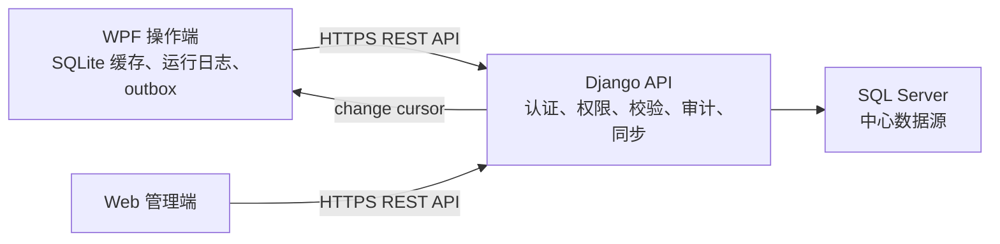

# VFD 三端互通与测试追溯设计

## 1. 目标与边界

本设计覆盖三个系统角色：

- WPF 操作端：操作员登录、选择工位和已发布方案、扫描变频器条码、执行设备测试、记录并上传完整追溯数据；工程人员也可以维护方案和逻辑点位。
- Web 管理端：通过后端 API 维护设备型号、逻辑点位、工位和测试方案。Web 代码不在本次实现范围内，但后端必须提供稳定契约。
- Django 后端：唯一业务入口和中心数据源负责人，处理权限、工厂隔离、数据校验、并发冲突、方案发布、审计、增量同步和执行数据接收。

SQL Server 是中心数据源。WPF 不直接读写中心数据库；WPF 使用本地 SQLite 保存已发布配置、运行日志和待上传数据，以保证短时断网时产线仍可工作。

本次不引入移动端、消息队列或微服务。第一阶段使用 HTTPS REST API 和游标增量拉取；实时推送可在稳定运行后增补。

## 2. 现状审查结论

### 2.1 已具备能力

- SQL Server 已落地 15 张 `vfd_*` 表，`vfd_control.0001_initial` 已登记。
- 已有设备型号、逻辑点位、工位、方案版本、步骤、会话、单机执行、步骤结果、测量结果、比较结果、命令追踪和审计模型。
- WPF 已有分层结构、方案编辑器、串口扫码、Modbus RTU、工作流执行器和追溯查询界面。
- WPF 当前全量自动化测试共 222 项，全部通过。

### 2.2 阻断问题

1. WPF 运行时使用内存仓储，未接入 Django API。
2. WPF 的旧 SQL 仓储使用 `ProcessPlans` 等另一套表结构，与 Django 的 `vfd_process_plans` 不兼容。
3. WPF 配置实体使用 UUID，Django 配置表使用自增整数，不能直接复用旧 SQL 仓储。
4. Django VFD 模块缺少 serializer、view、URL、权限和业务服务。
5. WPF 当前在步骤结果之后保存 `DeviceRun`，接入真实外键后保存顺序错误。
6. 当前没有条码设备主档、完整流程事件、客户端节点、增量变更流和幂等上传批次。
7. 已发布方案和已引用点位没有数据库级不可变策略。
8. 后端同时存在 `core.User` 与 `user.SysUser`，VFD 审计需要统一采用当前 JWT 对应的 `SysUser`。
9. 工厂隔离、对象级权限、安全配置和 CORS 配置不满足生产环境要求。
10. `django_migrations` 中存在重复的 `user.0001_initial` 记录，需要只清理重复登记，不重建业务表。

## 3. 架构决定

采用“Django API 单一入口 + WPF SQLite 缓存和 outbox”架构。



关键规则：

- Web 和 WPF 维护配置时必须调用同一套 Django API。
- 发布版本不可修改；修改必须从已发布版本复制出新草稿。
- 一次测试启动后固定使用当时的方案快照和点位快照。
- 配置删除使用软删除；被历史记录引用的数据禁止物理删除。
- WPF 通过 `revision` 执行乐观并发控制，版本冲突返回 HTTP 409。
- 每次配置变化在同一数据库事务内写入 `vfd_change_feed`。
- 每个 WPF 上传批次使用稳定的 `batch_id`，重复提交只返回原处理结果。

## 4. 中心数据库设计

### 4.1 通用字段规则

配置类表统一具备：

| 字段 | 类型 | 规则 |
| --- | --- | --- |
| `factory_id` | `BIGINT` | 必填，所有查询和唯一约束均包含工厂范围 |
| `revision` | `BIGINT` | 从 1 开始，每次有效修改递增 |
| `is_deleted` | `BIT` | 软删除标志，默认 0 |
| `created_at` | `DATETIMEOFFSET` | 由服务端填写 |
| `updated_at` | `DATETIMEOFFSET` | 由服务端填写 |

执行追溯表不允许软删除。确需纠正时写审计记录和作废状态，不删除原始数据。

### 4.2 现有表调整

| 表 | 定位 | 必要调整 |
| --- | --- | --- |
| `vfd_device_models` | 变频器型号及通信默认值 | 增加 `revision/is_deleted`；型号编码按工厂唯一 |
| `vfd_logical_points` | 型号下可读写寄存器定义 | 增加 `register_count/byte_order/word_order/bit_index/revision/is_deleted`；禁止物理删除已发布版本使用的点位 |
| `vfd_logical_point_write_options` | 可写点位候选值 | 增加 `revision/is_deleted`；同一点位值唯一 |
| `vfd_stations` | 测试工位 | 增加 `client_node_id/revision/is_deleted` |
| `vfd_station_slots` | 工位槽位和通信端点 | 增加 `port_name/baud_rate/data_bits/stop_bits/parity/vfd_slave_address/voltage_meter_address/current_meter_address/revision/is_deleted` |
| `vfd_process_plans` | 方案逻辑主档 | 增加 `device_model_id/current_published_version_id/revision/is_deleted` |
| `vfd_process_plan_versions` | 方案不可变版本 | 增加 `checksum`；状态限定为 `draft/published/retired`；发布后不可更新步骤 |
| `vfd_process_steps` | 版本步骤 | 增加 `timeout_ms/retry_delay_ms/config_snapshot`；发布后不可增删改 |
| `vfd_station_sessions` | 一次工位级测试会话 | 增加 `client_node_id/work_order_id/status`；记录结束时间和最终结论 |
| `vfd_device_runs` | 一个条码的一次测试尝试 | 增加 `device_unit_id/attempt_no/status/plan_version_id/plan_snapshot`；先创建再执行步骤 |
| `vfd_step_runs` | 单步骤执行 | 增加 `attempt_no/status`；先写 Running，再更新完成状态 |
| `vfd_measurement_results` | 采样结果 | 增加 `sampled_at/raw_value/quality_code` |
| `vfd_comparison_results` | 比较结论 | 固化左右点位、实测值和容差快照 |
| `vfd_command_traces` | 通信命令追踪 | 增加 `occurred_at/duration_ms/error_category` |
| `vfd_audit_logs` | 配置操作审计 | 增加 `source/client_node_id/request_id/revision`；保存修改前后 JSON |

### 4.3 新增中心表

#### `vfd_device_units`

表示由唯一条码识别的一台变频器，而不是某次测试。

| 字段 | 类型 | 规则 |
| --- | --- | --- |
| `id` | `UUID` | 主键，由服务端或 WPF 首次扫码时生成 |
| `factory_id` | `BIGINT` | 工厂外键 |
| `barcode` | `NVARCHAR(100)` | 与 `factory_id` 组成唯一约束 |
| `device_model_id` | `BIGINT` | 设备型号，可在校验阶段确定 |
| `product_id` | `BIGINT` | 产品，可空 |
| `work_order_id` | `BIGINT` | 当前工单，可空 |
| `current_status` | `NVARCHAR(32)` | `created/testing/passed/failed/blocked` |
| `first_scanned_at` | `DATETIMEOFFSET` | 首次扫码时间 |
| `last_tested_at` | `DATETIMEOFFSET` | 最近测试时间，可空 |

索引：`UNIQUE(factory_id, barcode)`、`INDEX(factory_id, current_status)`。

#### `vfd_run_events`

记录扫码到测试完成之间的业务事件。

| 字段 | 类型 | 规则 |
| --- | --- | --- |
| `id` | `UUID` | 主键，也是上传幂等键 |
| `factory_id` | `BIGINT` | 工厂外键 |
| `device_run_id` | `UUID` | 单机执行外键，可在扫码预创建后关联 |
| `sequence` | `INT` | 单次执行内严格递增 |
| `event_type` | `NVARCHAR(50)` | 事件类型 |
| `occurred_at` | `DATETIMEOFFSET` | WPF 发生时间 |
| `received_at` | `DATETIMEOFFSET` | 服务端接收时间 |
| `operator_id` | `INT` | `SysUser` 外键，可空 |
| `client_node_id` | `UUID` | WPF 节点外键 |
| `payload_json` | `NVARCHAR(MAX)` | 事件扩展数据 |

唯一约束：`(device_run_id, sequence)`。

事件类型至少包括：`BarcodeScanned`、`BarcodeValidated`、`SlotAssigned`、`DeviceConnected`、`TestStarted`、`StepStarted`、`StepCompleted`、`TestCompleted`、`UploadQueued`、`Uploaded`、`Aborted`。

#### `vfd_client_nodes`

| 字段 | 类型 | 规则 |
| --- | --- | --- |
| `id` | `UUID` | 主键 |
| `factory_id` | `BIGINT` | 工厂外键 |
| `client_code` | `NVARCHAR(64)` | 工厂内唯一 |
| `station_id` | `BIGINT` | 绑定工位，可空 |
| `machine_name` | `NVARCHAR(128)` | WPF 机器名 |
| `app_version` | `NVARCHAR(32)` | 客户端版本 |
| `last_seen_at` | `DATETIMEOFFSET` | 最近心跳 |
| `is_active` | `BIT` | 是否允许同步和上传 |

#### `vfd_change_feed`

| 字段 | 类型 | 规则 |
| --- | --- | --- |
| `cursor` | `BIGINT IDENTITY` | 主键、增量同步游标 |
| `factory_id` | `BIGINT` | 工厂外键 |
| `entity_type` | `NVARCHAR(64)` | 型号、点位、方案等 |
| `entity_id` | `NVARCHAR(64)` | 兼容整数和 UUID 主键 |
| `operation` | `NVARCHAR(16)` | `upsert/delete/publish` |
| `revision` | `BIGINT` | 对象修改后版本 |
| `changed_at` | `DATETIMEOFFSET` | 服务端时间 |
| `payload_json` | `NVARCHAR(MAX)` | 可选的轻量变更内容 |

索引：`INDEX(factory_id, cursor)`。变更流按保留期清理，客户端游标落后于保留期时必须执行全量同步。

#### `vfd_ingest_batches`

| 字段 | 类型 | 规则 |
| --- | --- | --- |
| `id` | `UUID` | 主键 |
| `factory_id` | `BIGINT` | 工厂外键 |
| `client_node_id` | `UUID` | 客户端外键 |
| `batch_id` | `UUID` | 客户端生成 |
| `status` | `NVARCHAR(20)` | `processing/accepted/rejected` |
| `payload_hash` | `CHAR(64)` | SHA-256，防止同 ID 不同内容 |
| `received_at` | `DATETIMEOFFSET` | 接收时间 |
| `processed_at` | `DATETIMEOFFSET` | 完成时间，可空 |
| `result_json` | `NVARCHAR(MAX)` | 原处理结果，用于重复请求复用 |

唯一约束：`(client_node_id, batch_id)`。

### 4.4 数据一致性规则

- 子记录的 `factory_id` 必须与父记录一致，由服务层验证；关键写入使用事务。
- 方案绑定的逻辑点位必须属于方案的 `device_model_id`。
- 同一方案版本的 `sequence` 唯一且连续，从 1 开始。
- 发布前验证步骤类型、目标点位、写权限、比较点位、容差、超时和失败策略。
- `published` 版本及其步骤不可修改；只能标记 `retired`。
- 同一设备条码允许多次测试，但 `attempt_no` 必须递增。
- 同一槽位同一时刻只允许一个 `running` 执行。
- 历史执行记录使用 `PROTECT/RESTRICT`，不得因删除配置或工厂而级联删除。

## 5. WPF 本地数据库设计

WPF 使用 SQLite，数据库位于应用数据目录，不随程序升级覆盖。

| 表 | 关键字段 | 用途 |
| --- | --- | --- |
| `local_config_packages` | `package_type/entity_id/revision/checksum/payload_json/is_active` | 缓存设备型号、点位、工位和已发布方案完整包 |
| `local_run_journal` | `event_id/device_run_id/sequence/event_type/payload_json/occurred_at` | 测试过程实时落盘，断电后恢复 |
| `local_outbox` | `batch_id/aggregate_id/payload_json/status/retry_count/next_retry_at` | 保存待上传批次 |
| `local_sync_state` | `stream_name/cursor/last_success_at/last_error` | 保存增量同步进度 |

写入顺序：先写本地 journal，再执行下一设备操作；测试完成后构造 outbox 批次。服务端确认 `accepted` 后才能标记本地记录已上传。

## 6. API 契约

### 6.1 配置管理

- `GET/POST /api/vfd/device-models/`
- `GET/PATCH/DELETE /api/vfd/device-models/{id}/`
- `GET/POST /api/vfd/logical-points/`
- `GET/PATCH/DELETE /api/vfd/logical-points/{id}/`
- `GET/POST /api/vfd/stations/`
- `GET/PATCH /api/vfd/stations/{id}/`
- `GET/POST /api/vfd/plans/`
- `POST /api/vfd/plans/{id}/versions/clone/`
- `PATCH /api/vfd/plan-versions/{id}/draft/`
- `POST /api/vfd/plan-versions/{id}/validate/`
- `POST /api/vfd/plan-versions/{id}/publish/`

配置更新必须携带 `If-Match: <revision>`。revision 不匹配返回：

```json
{
  "code": "revision_conflict",
  "message": "配置已被其他客户端修改",
  "current_revision": 8
}
```

### 6.2 WPF 同步

- `POST /api/vfd/clients/register/`
- `POST /api/vfd/clients/{id}/heartbeat/`
- `GET /api/vfd/sync/bootstrap/`：首次或游标失效时下载完整运行配置包。
- `GET /api/vfd/sync/changes/?after={cursor}&limit=500`：增量获取配置变化。

WPF 每 5 秒拉取一次变更；进入后台或网络异常时指数退避，最大 60 秒。运行中的设备继续使用启动快照，新的已发布版本只影响后续执行。

### 6.3 执行追溯

- `POST /api/vfd/execution/batches/`：批量上传运行事件、步骤、测量、比较和命令记录。
- `GET /api/vfd/device-runs/?barcode=...`
- `GET /api/vfd/device-runs/{id}/trace/`

批量上传是原子操作。相同 `client_node_id + batch_id + payload_hash` 重复请求返回第一次结果；相同批次 ID 但 hash 不同返回 HTTP 409。

## 7. WPF 执行流程

1. 启动应用，注册客户端并同步配置。
2. 操作员登录，选择工位、工单和已发布方案。
3. 扫描条码，本地立即写 `BarcodeScanned`。
4. 使用缓存规则做格式校验；在线时向后端确认条码、工单、产品和型号，写 `BarcodeValidated`。
5. 分配槽位并创建本地 `device_run_id`，写 `SlotAssigned`。
6. 创建服务端或本地待上传的 DeviceRun，再连接设备，写 `DeviceConnected`。
7. 写 `TestStarted`，按固定方案快照执行。
8. 每个步骤先写 `StepStarted`，完成后保存命令、测量、比较和 `StepCompleted`。
9. 聚合结论并写 `TestCompleted`；异常、人工停止或断电恢复失败写 `Aborted`。
10. 生成 outbox 批次并写 `UploadQueued`。
11. 上传成功后写本地 `Uploaded` 标记；服务端不依赖客户端再次上传该标记才能认定测试完成。

## 8. 权限与安全

- WPF 与 Web 共用 JWT 认证，审计用户统一引用 `SysUser`。
- 操作员只能读取已发布方案、上传测试数据和查询授权工位记录。
- 工程人员可维护草稿和点位；发布方案需要独立权限。
- 所有 queryset 强制按当前用户工厂过滤，不接受客户端任意指定其他工厂。
- 数据库连接串、Django `SECRET_KEY` 和 JWT 密钥移到环境变量或服务器密钥配置。
- 生产环境关闭 `DEBUG`，移除 `CORS_ORIGIN_ALLOW_ALL`，只允许明确 Web 来源。
- WPF 不保存 SQL Server 账号；API 地址和客户端凭据使用受保护配置。

## 9. 错误处理

- 配置冲突：返回 409，客户端保留本地编辑内容并提示重新加载或复制为新草稿。
- 同步游标过期：返回 `full_sync_required`，WPF 下载完整配置包并原子替换缓存。
- 网络中断：WPF 继续使用最后一次有效已发布配置，运行结果进入 outbox。
- 批次部分非法：整批拒绝并返回精确到事件/步骤的错误位置，不产生半批数据。
- 应用崩溃：重启后读取 `local_run_journal`，将未结束测试标记为待恢复或 `Aborted`，不得静默丢弃。
- 设备通信错误：保留请求、响应、错误分类和耗时，并按步骤失败策略处理。

## 10. 测试与验收

### 10.1 后端

- 模型约束、工厂隔离和软删除测试。
- 草稿编辑、发布校验、已发布版本不可变测试。
- revision 冲突和审计日志测试。
- change feed 顺序、删除事件和游标过期测试。
- 上传批次原子性、重复提交和 hash 冲突测试。

### 10.2 WPF

- API DTO 与领域模型映射测试。
- 首次全量同步、增量同步、删除同步和 revision 冲突测试。
- 本地 journal 在每个步骤前后持久化测试。
- 网络中断、重启恢复、重试上传和幂等测试。
- 运行中收到新方案时仍使用原快照测试。

### 10.3 三端验收场景

1. Web 修改逻辑点位并发布方案后，在线 WPF 在 10 秒内取得新版本。
2. WPF 修改草稿后，Web 通过刷新 API 立即看到相同内容和 revision。
3. Web 与 WPF 同时修改同一草稿时，后提交方收到 409，不覆盖先提交内容。
4. 测试运行中发布新版本，当前条码继续使用旧快照，下一个条码使用新版本。
5. WPF 断网后完成测试，重连后只上传一次，服务端追溯链完整。
6. 按条码可查到扫码、操作员、工位、槽位、方案版本、每一步、命令、测量和最终结论。
7. WPF 进程在任一步骤后被强制结束，重启后能识别未完成执行并形成明确结果。

## 11. 实施顺序

1. 后端基线与安全修复：配置外置、生产设置、工厂隔离、用户审计统一、迁移历史检查。
2. 中心模型迁移：调整 15 张现有表，新增 5 张中心表和约束索引。
3. 配置 API：设备型号、点位、工位、方案草稿、校验、发布、审计和 revision 冲突。
4. 同步 API：客户端注册、心跳、全量配置包和 change feed。
5. WPF API 基础设施：HTTP 客户端、认证、DTO、错误映射和 SQLite。
6. WPF 配置同步：bootstrap、增量拉取、缓存原子替换、方案/点位编辑改走 API。
7. 追溯写入修正：父记录先创建、运行状态更新、完整事件和结果实时落本地。
8. 执行上传 API 与 WPF outbox：批次原子入库、幂等、断网重试和崩溃恢复。
9. 查询与追溯页面：按条码、工位、时间、结论查询完整链路。
10. 联调、数据校验、备份恢复、灰度启用和三端验收。

## 12. 迁移与上线原则

- 在任何生产迁移前执行 SQL Server 完整备份并验证可恢复性。
- 只通过 Django migration 改中心库，不再执行 WPF `schema.sql` 创建中心表。
- 第一轮只新增字段和表，不删除旧列；确认 WPF/API 切换完成后再安排兼容列清理。
- WPF 先以功能开关启用 API 模式，保留 Simulation 模式用于测试；旧的中心 SQL 直连实现停止注册，稳定后删除。
- 上线初期同时监控客户端心跳、change feed 游标延迟、outbox 积压、批次拒绝率和测试结果数量。
